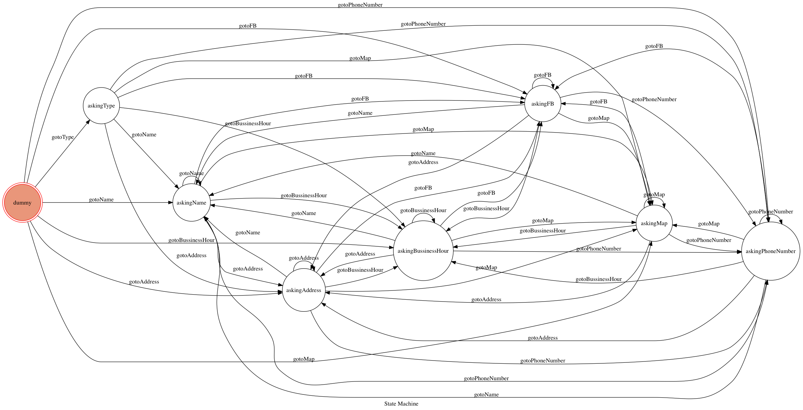

# TOC chatbot project-台南美食分享

## 如何使用？
1. 有兩個選擇可以選：
a. 想知道＋餐廳類型
b. 想知道＋餐聽名字
目前支援的類型有
["火鍋","中式小吃","義式料理","越南料理","早點","早午餐","鐵板燒","日式料理"]
而餐廳名字或類別如果無此資料的話，就會回傳錯誤訊息並重新輸入．

2. 若使用者請求類型且成功的話，chatbot將會回傳所以符合請求類型的餐廳名單，接著使用者便可以輸入"想知道＋選其中一間餐廳的全名"來進入下一階段．
3. chatbot會回傳這間餐廳的相關資訊清單，包含地址，聯絡方式，營業時間，google map，fb．
4. 使用者只要打上想知道的資訊：例如輸入"地址"，chatbot就會回傳地址，以此類推．
5. 只要打上"想重新輸入餐廳名字" or "想重新輸入餐廳類型" 便可以回到step 1．

## 如何實作
1. 先使用beautiful soup來做網路爬蟲，從餐廳fb粉專上蒐集資料．
2. 把收集到的資料處理完後存進mongodb altas(mongodb的雲端資料庫)．
3. 每當有user input時，根據在哪一個state來perform相對應的find document來獲取data

## Finite state machine graph:

